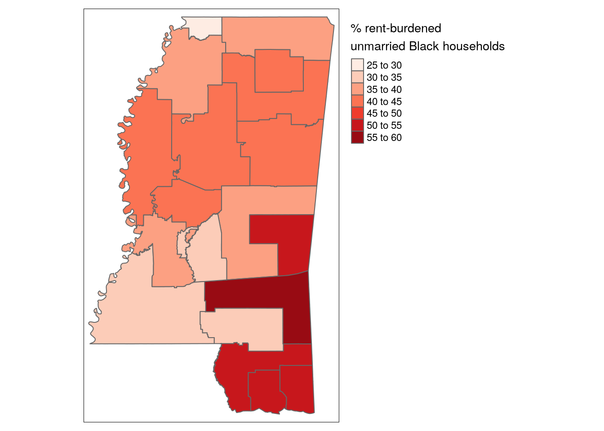

# Analyzing Census microdata


A major benefit of using the individual-level microdata returned by `get_pums()` is the ability to create detailed, granular estimates of ACS data. While the aggregate ACS data available with `get_acs()` includes tens of thousands of indicators to choose from, researchers and analysts still may be interested in cross-tabulations not available in the aggregate files. Additionally, microdata helps researchers design statistical models to assess demographic relationships at the individual level in a way not possible with aggregate data.

Analysts must pay careful attention to the structure of the PUMS datasets in order to produce accurate estimates and handle errors appropriately. PUMS datasets are *weighted* samples, in which each person or household is not considered unique or individual, but rather representative of multiple other persons or households. In turn, analyses and tabulations using PUMS data must use appropriate tools for handling weighting variables to accurately produce estimates. Fortunately, tidyverse tools like **dplyr**, covered elsewhere in this book, are excellent for producing these tabulations and handling survey weights

As covered in Chapter 3, data from the American Community Survey are based on a sample and in turn characterized by error. This means that ACS data acquired with `get_pums()` are similarly characterized by error, which can be substantial when cross-tabulations are highly specific. Fortunately, the US Census Bureau provides *replicate weights* to help analysts generate standard errors around tabulated estimates with PUMS data as they take into account the complex structure of the survey sample. While working with replicate weights has traditionally been cumbersome for analysts, **tidycensus** with help from the **survey** [@lumley2010] and **srvyr** [@ellis2021] R packages has integrated tools for handling replicate weights and correctly estimating standard errors when tabulating and modeling data. These workflows will be covered later in this chapter.

## PUMS data and the tidyverse

As discussed in Chapter \@ref(introduction-to-census-microdata), `get_pums()` automatically returns data with both household (`WGTP`) and person (`PWGTP`) weights. These weights can loosely be interpreted as the number of households or persons represented by each individual row in the PUMS data. Appropriate use of these weights columns is essential for tabulating accurate estimates of population characteristics with PUMS data. Fortunately, weighted tabulations work quite well within familiar tidyverse workflows, such as those covered in Chapter \@ref(wrangling-census-data-with-tidyverse-tools).

### Basic tabulation of weights with tidyverse tools

Let's get some basic sample PUMS data from the 2016-2020 ACS for Mississippi with information on sex and age.


```r
library(tidycensus)
library(tidyverse)

ms_pums <- get_pums(
  variables = c("SEX", "AGEP"),
  state = "MS",
  survey = "acs5",
  year = 2020,
  recode = TRUE
)
```

Let's take a quick look at our data:

<table class="table table-striped table-hover table-condensed table-responsive" style="margin-left: auto; margin-right: auto;">
<caption>(\#tab:glimpse-ms-pums)PUMS data for Mississippi</caption>
 <thead>
  <tr>
   <th style="text-align:left;position: sticky; top:0; background-color: #FFFFFF;"> SERIALNO </th>
   <th style="text-align:right;position: sticky; top:0; background-color: #FFFFFF;"> SPORDER </th>
   <th style="text-align:right;position: sticky; top:0; background-color: #FFFFFF;"> WGTP </th>
   <th style="text-align:right;position: sticky; top:0; background-color: #FFFFFF;"> PWGTP </th>
   <th style="text-align:right;position: sticky; top:0; background-color: #FFFFFF;"> AGEP </th>
   <th style="text-align:left;position: sticky; top:0; background-color: #FFFFFF;"> ST </th>
   <th style="text-align:left;position: sticky; top:0; background-color: #FFFFFF;"> SEX </th>
   <th style="text-align:left;position: sticky; top:0; background-color: #FFFFFF;"> ST_label </th>
   <th style="text-align:left;position: sticky; top:0; background-color: #FFFFFF;"> SEX_label </th>
  </tr>
 </thead>
<tbody>
  <tr>
   <td style="text-align:left;"> 2016000000411 </td>
   <td style="text-align:right;"> 1 </td>
   <td style="text-align:right;"> 54 </td>
   <td style="text-align:right;"> 54 </td>
   <td style="text-align:right;"> 30 </td>
   <td style="text-align:left;"> 28 </td>
   <td style="text-align:left;"> 1 </td>
   <td style="text-align:left;"> Mississippi/MS </td>
   <td style="text-align:left;"> Male </td>
  </tr>
  <tr>
   <td style="text-align:left;"> 2016000000411 </td>
   <td style="text-align:right;"> 2 </td>
   <td style="text-align:right;"> 54 </td>
   <td style="text-align:right;"> 95 </td>
   <td style="text-align:right;"> 22 </td>
   <td style="text-align:left;"> 28 </td>
   <td style="text-align:left;"> 2 </td>
   <td style="text-align:left;"> Mississippi/MS </td>
   <td style="text-align:left;"> Female </td>
  </tr>
  <tr>
   <td style="text-align:left;"> 2016000000739 </td>
   <td style="text-align:right;"> 1 </td>
   <td style="text-align:right;"> 27 </td>
   <td style="text-align:right;"> 26 </td>
   <td style="text-align:right;"> 51 </td>
   <td style="text-align:left;"> 28 </td>
   <td style="text-align:left;"> 1 </td>
   <td style="text-align:left;"> Mississippi/MS </td>
   <td style="text-align:left;"> Male </td>
  </tr>
  <tr>
   <td style="text-align:left;"> 2016000000739 </td>
   <td style="text-align:right;"> 2 </td>
   <td style="text-align:right;"> 27 </td>
   <td style="text-align:right;"> 17 </td>
   <td style="text-align:right;"> 17 </td>
   <td style="text-align:left;"> 28 </td>
   <td style="text-align:left;"> 2 </td>
   <td style="text-align:left;"> Mississippi/MS </td>
   <td style="text-align:left;"> Female </td>
  </tr>
  <tr>
   <td style="text-align:left;"> 2016000000803 </td>
   <td style="text-align:right;"> 1 </td>
   <td style="text-align:right;"> 3 </td>
   <td style="text-align:right;"> 3 </td>
   <td style="text-align:right;"> 30 </td>
   <td style="text-align:left;"> 28 </td>
   <td style="text-align:left;"> 2 </td>
   <td style="text-align:left;"> Mississippi/MS </td>
   <td style="text-align:left;"> Female </td>
  </tr>
  <tr>
   <td style="text-align:left;"> 2016000000803 </td>
   <td style="text-align:right;"> 2 </td>
   <td style="text-align:right;"> 3 </td>
   <td style="text-align:right;"> 4 </td>
   <td style="text-align:right;"> 8 </td>
   <td style="text-align:left;"> 28 </td>
   <td style="text-align:left;"> 1 </td>
   <td style="text-align:left;"> Mississippi/MS </td>
   <td style="text-align:left;"> Male </td>
  </tr>
  <tr>
   <td style="text-align:left;"> 2016000000858 </td>
   <td style="text-align:right;"> 1 </td>
   <td style="text-align:right;"> 9 </td>
   <td style="text-align:right;"> 9 </td>
   <td style="text-align:right;"> 90 </td>
   <td style="text-align:left;"> 28 </td>
   <td style="text-align:left;"> 1 </td>
   <td style="text-align:left;"> Mississippi/MS </td>
   <td style="text-align:left;"> Male </td>
  </tr>
  <tr>
   <td style="text-align:left;"> 2016000000858 </td>
   <td style="text-align:right;"> 2 </td>
   <td style="text-align:right;"> 9 </td>
   <td style="text-align:right;"> 24 </td>
   <td style="text-align:right;"> 63 </td>
   <td style="text-align:left;"> 28 </td>
   <td style="text-align:left;"> 1 </td>
   <td style="text-align:left;"> Mississippi/MS </td>
   <td style="text-align:left;"> Male </td>
  </tr>
  <tr>
   <td style="text-align:left;"> 2016000000901 </td>
   <td style="text-align:right;"> 1 </td>
   <td style="text-align:right;"> 16 </td>
   <td style="text-align:right;"> 16 </td>
   <td style="text-align:right;"> 70 </td>
   <td style="text-align:left;"> 28 </td>
   <td style="text-align:left;"> 1 </td>
   <td style="text-align:left;"> Mississippi/MS </td>
   <td style="text-align:left;"> Male </td>
  </tr>
  <tr>
   <td style="text-align:left;"> 2016000000901 </td>
   <td style="text-align:right;"> 2 </td>
   <td style="text-align:right;"> 16 </td>
   <td style="text-align:right;"> 24 </td>
   <td style="text-align:right;"> 65 </td>
   <td style="text-align:left;"> 28 </td>
   <td style="text-align:left;"> 2 </td>
   <td style="text-align:left;"> Mississippi/MS </td>
   <td style="text-align:left;"> Female </td>
  </tr>
</tbody>
</table>

As we learned in Chapter \@ref(analyzing-census-microdata), the number of people in Mississippi can be tabulated by summing over the person-weight column:


```r
sum(ms_pums$PWGTP)
```

```
## [1] 2981835
```

We can perform similar calculations with tidyverse tools. The `count()` function in the dplyr package performs a simple tabulation of your data. The optional `wt` argument in `count()` allows you to specify a weight column, which in this case will be our person-weight.


```r
ms_pums %>% count(wt = PWGTP)
```

```
## # A tibble: 1 × 1
##         n
##     <dbl>
## 1 2981835
```

`count()` has the additional benefit of allowing for the specification of one our more columns that will be grouped and tabulated. For example, we could tabulate data by unique values of age and sex in Mississippi. The `wt` argument in `count()` specifies the `PWGTP` column as the appropriate weight for data tabulation.


```r
ms_pums %>%
  count(SEX_label, AGEP, wt = PWGTP) 
```

```
## # A tibble: 186 × 3
##    SEX_label  AGEP     n
##    <ord>     <dbl> <dbl>
##  1 Male          0 18111
##  2 Male          1 19206
##  3 Male          2 18507
##  4 Male          3 18558
##  5 Male          4 20054
##  6 Male          5 17884
##  7 Male          6 18875
##  8 Male          7 18775
##  9 Male          8 19316
## 10 Male          9 20866
## # … with 176 more rows
```

We can also perform more custom analyses, such as tabulating the number of people over age 65 by sex in Mississippi. This involves specifying a filter condition to retain rows for records with an age of 65 and up, then tabulating by sex.


```r
ms_pums %>%
  filter(AGEP >= 65) %>%
  count(SEX, wt = PWGTP)
```

```
## # A tibble: 2 × 2
##   SEX        n
##   <chr>  <dbl>
## 1 1     206504
## 2 2     267707
```

We can then use `get_acs()` to check our answer:


```r
get_acs(geography = "state",
        state = "MS",
        variables = c("DP05_0030", "DP05_0031"),
        year = 2020)
```

```
## # A tibble: 2 × 5
##   GEOID NAME        variable  estimate   moe
##   <chr> <chr>       <chr>        <dbl> <dbl>
## 1 28    Mississippi DP05_0030   206518   547
## 2 28    Mississippi DP05_0031   267752   466
```

We notice that our tabulations are very close to the ACS estimates available in `get_acs()`, and well within the margin of error. When we are doing tabulations with microdata, it is important to remember that we are tabulating data based on a smaller subsample of information than is available to the aggregate ACS estimates. In turn, as the US Census Bureau reminds us [@pums_readme]:

> Because PUMS data consist of a subset of the full ACS sample, tabulations from the ACS PUMS will not match those from published tables of ACS data.

Analysts will often want to use PUMS data and the tabulated aggregate ACS data in tandem as appropriate, as each data type offers complimentary strengths. As the aggregate ACS data are based on a larger sample, its data aggregations will be preferable to those produced with PUMS data. However, PUMS data offer the ability to compute detailed cross-tabulations not available in aggregate ACS tables and to fit models of demographic relationships at the individual level. Examples of each follow in this chapter.

### Group-wise data tabulation

When combined with tidyverse tools as introduced in Chapter \@ref(wrangling-census-data-with-tidyverse-tools), PUMS data can produce highly detailed estimates not available in the regular aggregate ACS. The example below acquires data on rent burden, family type, and race/ethnicity to examine intersections between these variables for households in Mississippi. The `PUMA` variable is also included for use later in this chapter.

Our guiding research question is as follows: how does rent burden vary by race/ethnicity and household type for Mississippi households? This requires obtaining data on rent burden (gross rent as percentage of household income) with variable `GRPIP`; race and ethnicity with variables `RAC1P` and `HISP`; and household type with variable `HHT`. The `variables_filter` argument is used to filter the sample to only renter-occupied households paying cash rent, speeding download times.


```r
hh_variables <- c("PUMA", "GRPIP", "RAC1P", 
                  "HISP", "HHT")

ms_hh_data <- get_pums(
  variables = hh_variables, 
  state = "MS",
  year = 2020,
  variables_filter = list(
    SPORDER = 1,
    TEN = 3
  ),
  recode = TRUE
)
```

We can take a quick look at our data:

<table class="table table-striped table-hover table-condensed table-responsive" style="margin-left: auto; margin-right: auto;">
<caption>(\#tab:style-ms-hh)Household microdata for Mississippi</caption>
 <thead>
  <tr>
   <th style="text-align:left;position: sticky; top:0; background-color: #FFFFFF;"> SERIALNO </th>
   <th style="text-align:right;position: sticky; top:0; background-color: #FFFFFF;"> SPORDER </th>
   <th style="text-align:right;position: sticky; top:0; background-color: #FFFFFF;"> WGTP </th>
   <th style="text-align:right;position: sticky; top:0; background-color: #FFFFFF;"> PWGTP </th>
   <th style="text-align:right;position: sticky; top:0; background-color: #FFFFFF;"> GRPIP </th>
   <th style="text-align:left;position: sticky; top:0; background-color: #FFFFFF;"> PUMA </th>
   <th style="text-align:left;position: sticky; top:0; background-color: #FFFFFF;"> ST </th>
   <th style="text-align:left;position: sticky; top:0; background-color: #FFFFFF;"> TEN </th>
   <th style="text-align:left;position: sticky; top:0; background-color: #FFFFFF;"> HHT </th>
   <th style="text-align:left;position: sticky; top:0; background-color: #FFFFFF;"> HISP </th>
   <th style="text-align:left;position: sticky; top:0; background-color: #FFFFFF;"> RAC1P </th>
   <th style="text-align:left;position: sticky; top:0; background-color: #FFFFFF;"> ST_label </th>
   <th style="text-align:left;position: sticky; top:0; background-color: #FFFFFF;"> TEN_label </th>
   <th style="text-align:left;position: sticky; top:0; background-color: #FFFFFF;"> HHT_label </th>
   <th style="text-align:left;position: sticky; top:0; background-color: #FFFFFF;"> HISP_label </th>
   <th style="text-align:left;position: sticky; top:0; background-color: #FFFFFF;"> RAC1P_label </th>
  </tr>
 </thead>
<tbody>
  <tr>
   <td style="text-align:left;"> 2017000908503 </td>
   <td style="text-align:right;"> 1 </td>
   <td style="text-align:right;"> 65 </td>
   <td style="text-align:right;"> 65 </td>
   <td style="text-align:right;"> 18 </td>
   <td style="text-align:left;"> 01300 </td>
   <td style="text-align:left;"> 28 </td>
   <td style="text-align:left;"> 3 </td>
   <td style="text-align:left;"> 3 </td>
   <td style="text-align:left;"> 01 </td>
   <td style="text-align:left;"> 2 </td>
   <td style="text-align:left;"> Mississippi/MS </td>
   <td style="text-align:left;"> Rented </td>
   <td style="text-align:left;"> Other family household: Female householder, no spouse present </td>
   <td style="text-align:left;"> Not Spanish/Hispanic/Latino </td>
   <td style="text-align:left;"> Black or African American alone </td>
  </tr>
  <tr>
   <td style="text-align:left;"> 2017000909310 </td>
   <td style="text-align:right;"> 1 </td>
   <td style="text-align:right;"> 11 </td>
   <td style="text-align:right;"> 12 </td>
   <td style="text-align:right;"> 63 </td>
   <td style="text-align:left;"> 00600 </td>
   <td style="text-align:left;"> 28 </td>
   <td style="text-align:left;"> 3 </td>
   <td style="text-align:left;"> 3 </td>
   <td style="text-align:left;"> 01 </td>
   <td style="text-align:left;"> 2 </td>
   <td style="text-align:left;"> Mississippi/MS </td>
   <td style="text-align:left;"> Rented </td>
   <td style="text-align:left;"> Other family household: Female householder, no spouse present </td>
   <td style="text-align:left;"> Not Spanish/Hispanic/Latino </td>
   <td style="text-align:left;"> Black or African American alone </td>
  </tr>
  <tr>
   <td style="text-align:left;"> 2017000909754 </td>
   <td style="text-align:right;"> 1 </td>
   <td style="text-align:right;"> 41 </td>
   <td style="text-align:right;"> 40 </td>
   <td style="text-align:right;"> 8 </td>
   <td style="text-align:left;"> 02000 </td>
   <td style="text-align:left;"> 28 </td>
   <td style="text-align:left;"> 3 </td>
   <td style="text-align:left;"> 5 </td>
   <td style="text-align:left;"> 01 </td>
   <td style="text-align:left;"> 9 </td>
   <td style="text-align:left;"> Mississippi/MS </td>
   <td style="text-align:left;"> Rented </td>
   <td style="text-align:left;"> Nonfamily household: Male householder: Not living alone </td>
   <td style="text-align:left;"> Not Spanish/Hispanic/Latino </td>
   <td style="text-align:left;"> Two or More Races </td>
  </tr>
  <tr>
   <td style="text-align:left;"> 2017000910334 </td>
   <td style="text-align:right;"> 1 </td>
   <td style="text-align:right;"> 25 </td>
   <td style="text-align:right;"> 25 </td>
   <td style="text-align:right;"> 8 </td>
   <td style="text-align:left;"> 01400 </td>
   <td style="text-align:left;"> 28 </td>
   <td style="text-align:left;"> 3 </td>
   <td style="text-align:left;"> 1 </td>
   <td style="text-align:left;"> 01 </td>
   <td style="text-align:left;"> 1 </td>
   <td style="text-align:left;"> Mississippi/MS </td>
   <td style="text-align:left;"> Rented </td>
   <td style="text-align:left;"> Married couple household </td>
   <td style="text-align:left;"> Not Spanish/Hispanic/Latino </td>
   <td style="text-align:left;"> White alone </td>
  </tr>
  <tr>
   <td style="text-align:left;"> 2017000910561 </td>
   <td style="text-align:right;"> 1 </td>
   <td style="text-align:right;"> 10 </td>
   <td style="text-align:right;"> 11 </td>
   <td style="text-align:right;"> 31 </td>
   <td style="text-align:left;"> 01100 </td>
   <td style="text-align:left;"> 28 </td>
   <td style="text-align:left;"> 3 </td>
   <td style="text-align:left;"> 3 </td>
   <td style="text-align:left;"> 01 </td>
   <td style="text-align:left;"> 2 </td>
   <td style="text-align:left;"> Mississippi/MS </td>
   <td style="text-align:left;"> Rented </td>
   <td style="text-align:left;"> Other family household: Female householder, no spouse present </td>
   <td style="text-align:left;"> Not Spanish/Hispanic/Latino </td>
   <td style="text-align:left;"> Black or African American alone </td>
  </tr>
</tbody>
</table>

To analyze rent burdens with respect to the marital status and race/ethnicity of the householder, it will be useful to do some additional recoding using **dplyr**'s `case_when()` function. A new `race_ethnicity` column will identify householders by general categories, and a `married` column will identify whether or not the household is a married-couple household.


```r
ms_hh_recoded <- ms_hh_data %>%
  mutate(
    race_ethnicity = case_when(
      HISP != "01" ~ "Hispanic",
      HISP == "01" & RAC1P == "1" ~ "White",
      HISP == "01" & RAC1P == "2" ~ "Black",
      TRUE ~ "Other"
    ),
    married = case_when(
      HHT == "1" ~ "Married",
      TRUE ~ "Not married"
    )
  )
```

This information can then be summarized with respect to the household weight variable `WGTP` and the rent burden variable `GRPIP` within a `group_by() %>% summarize()` workflow. The dataset is filtered to only non-Hispanic white, non-Hispanic Black, and Hispanic householders to focus on those groups, then grouped by race/ethnicity and marital status. Within the `summarize()` call, the percentage of each subgroup paying 40 percent or more of their household incomes in rent is calculated by summing over the household weight column `WGTP`, but filtering for households with rent burdens of 40 percent or more in the numerator.


```r
ms_hh_summary <- ms_hh_recoded %>%
  filter(race_ethnicity != "Other") %>%
  group_by(race_ethnicity, married) %>%
  summarize(
    prop_above_40 = sum(WGTP[GRPIP >= 40]) / sum(WGTP)
  )
```

We can now check our result:

<table class="table table-striped table-hover table-condensed table-responsive" style="margin-left: auto; margin-right: auto;">
<caption>(\#tab:ms-hh-summary-show)Tabulated PUMS data for Mississippi</caption>
 <thead>
  <tr>
   <th style="text-align:left;position: sticky; top:0; background-color: #FFFFFF;"> race_ethnicity </th>
   <th style="text-align:left;position: sticky; top:0; background-color: #FFFFFF;"> married </th>
   <th style="text-align:right;position: sticky; top:0; background-color: #FFFFFF;"> prop_above_40 </th>
  </tr>
 </thead>
<tbody>
  <tr>
   <td style="text-align:left;"> Black </td>
   <td style="text-align:left;"> Married </td>
   <td style="text-align:right;"> 0.1625791 </td>
  </tr>
  <tr>
   <td style="text-align:left;"> Black </td>
   <td style="text-align:left;"> Not married </td>
   <td style="text-align:right;"> 0.4080033 </td>
  </tr>
  <tr>
   <td style="text-align:left;"> Hispanic </td>
   <td style="text-align:left;"> Married </td>
   <td style="text-align:right;"> 0.1716087 </td>
  </tr>
  <tr>
   <td style="text-align:left;"> Hispanic </td>
   <td style="text-align:left;"> Not married </td>
   <td style="text-align:right;"> 0.3569935 </td>
  </tr>
  <tr>
   <td style="text-align:left;"> White </td>
   <td style="text-align:left;"> Married </td>
   <td style="text-align:right;"> 0.1266644 </td>
  </tr>
  <tr>
   <td style="text-align:left;"> White </td>
   <td style="text-align:left;"> Not married </td>
   <td style="text-align:right;"> 0.3356546 </td>
  </tr>
</tbody>
</table>

The demographic group in this example with the largest rent burden is Black, Not married; nearly 41 percent of households in this group pay over 40 percent of their incomes in gross rent. The least rent-burdened group is White, Married, with a value under 13 percent. For each of the three racial/ethnic groups, there is a distinctive financial advantage for married-couple households over non-married households; this is particularly pronounced for Black householders.

## Mapping PUMS data

In the previous example, we see that rent burdens for Black, unmarried households are particularly acute in Mississippi. A follow-up question may involve an examination of how this trend varies geographically. As discussed in the previous chapter, the most granular geography available in the PUMS data is the PUMA, which generally includes 100,000-200,000 people. PUMA geographies are available in the **tigris** package with the function `pumas()`.


```r
library(tigris)
library(tmap)
options(tigris_use_cache = TRUE)

ms_pumas <- pumas("MS", year = 2020)

plot(ms_pumas$geometry)
```

<div class="figure">

<p class="caption">(\#fig:join-ms-data)Basic plot of PUMAs in Mississippi</p>
</div>

A geographical visualization of rent burdens in Mississippi requires a slight adaptation of the above code. Instead of returning a comparative table, the dataset should also be grouped by the `PUMA` column then filtered for the combination of variables that represent the group the analyst wants to visualize. In this case, the focus is on unmarried Black households by PUMA.


```r
ms_data_for_map <- ms_hh_recoded %>%
  group_by(race_ethnicity, married, PUMA) %>%
  summarize(
    percent_above_40 = 100 * (sum(WGTP[GRPIP >= 40]) / sum(WGTP))
  ) %>%
  filter(race_ethnicity == "Black",
         married == "Not married")
```

The output dataset has one row per PUMA and is suitable for joining to the spatial dataset for visualization.


```r
library(tmap)

joined_pumas <- ms_pumas %>%
  left_join(ms_data_for_map, by = c("PUMACE10" = "PUMA"))

tm_shape(joined_pumas) + 
  tm_polygons(col = "percent_above_40", 
              palette = "Reds",
              title = "% rent-burdened\nunmarried Black households") + 
  tm_layout(legend.outside = TRUE,
            legend.outside.position = "right")
```

<div class="figure">

<p class="caption">(\#fig:ms-pums-map)Map of rent-burdened unmarried Black household share by PUMA in Mississippi</p>
</div>

The map illustrates geographic variations in our indicator of interest. In particular, unmarried Black households are particularly rent-burdened along the Gulf Coast, with over half of households paying at least 40 percent of their household incomes in gross rent. The least rent-burdened areas for this demographic group are in the suburban PUMAs around Jackson.

## Survey design and the ACS PUMS

As earlier chapters have addressed, the American Community Survey is based on a *sample* of the US population and in turn subject to sampling error. This becomes particularly acute when dealing with small sub-populations like those explored at the PUMA level in the previous section. Given that PUMS data are individual-level records and not aggregates, standard errors and in turn margins of error must be computed by the analyst. Doing so correctly requires accounting for the complex sample design of the ACS. Fortunately, **tidycensus** with help from the **survey** and **srvyr** packages includes tools to assist with these tasks.

### Getting replicate weights

The Census Bureau recommends using the *Successive Difference Replication* method to compute standard errors around derived estimates from PUMS data. To calculate standard errors, the Census Bureau publishes 80 "replicate weights" for each observation, representing either person (PWGTP1 through PWGTP80) or household (WGTP1 through WGTP80) weights [@pums_readme]. The formula for computing the standard error $SE$ for a derived PUMS estimate $x$ is as follows:

$$
SE(x) = \sqrt{\frac{4}{80}\sum\limits_{r=1}^{80}(x_r-x)^2 }
$$

where $x$ is the PUMS estimate and $x_r$ is the rth weighted estimate.

With respect to SDR standard errors, the PUMS documentation acknowledges (p. 12),

> Successive Difference Replication (SDR) standard errors and margins of error are expected to be more accurate than generalized variance formulas (GVF) standard errors and margins of error, although they may be more inconvenient for some users to calculate.

The "inconvenience" is generally due to the need to download 80 additional weighting variables and prepare the equation written above. The `rep_weights` parameter in `get_pums()` makes it easier for users to retrieve the replicate weights variables without having to request all 80 directly. In a call to `get_pums()`, an analyst can use `rep_weights = "person"` for person-weights, `"housing"` for household weights, or `"both"` to get both sets.

The code below re-downloads the Mississippi rent burden dataset used above, but with household replicate weights included.


```r
ms_hh_replicate <- get_pums(
  variables = c("TEN", hh_variables), 
  state = "MS",
  recode = TRUE,
  year = 2020,
  variables_filter = list(
    SPORDER = 1
  ),
  rep_weights = "housing"
)
```


```r
names(ms_hh_replicate)
```

```
##  [1] "SERIALNO"    "SPORDER"     "GRPIP"       "PUMA"        "ST"         
##  [6] "TEN"         "HHT"         "HISP"        "RAC1P"       "ST_label"   
## [11] "TEN_label"   "HHT_label"   "HISP_label"  "RAC1P_label" "WGTP"       
## [16] "PWGTP"       "WGTP1"       "WGTP2"       "WGTP3"       "WGTP4"      
## [21] "WGTP5"       "WGTP6"       "WGTP7"       "WGTP8"       "WGTP9"      
## [26] "WGTP10"      "WGTP11"      "WGTP12"      "WGTP13"      "WGTP14"     
## [31] "WGTP15"      "WGTP16"      "WGTP17"      "WGTP18"      "WGTP19"     
## [36] "WGTP20"      "WGTP21"      "WGTP22"      "WGTP23"      "WGTP24"     
## [41] "WGTP25"      "WGTP26"      "WGTP27"      "WGTP28"      "WGTP29"     
## [46] "WGTP30"      "WGTP31"      "WGTP32"      "WGTP33"      "WGTP34"     
## [51] "WGTP35"      "WGTP36"      "WGTP37"      "WGTP38"      "WGTP39"     
## [56] "WGTP40"      "WGTP41"      "WGTP42"      "WGTP43"      "WGTP44"     
## [61] "WGTP45"      "WGTP46"      "WGTP47"      "WGTP48"      "WGTP49"     
## [66] "WGTP50"      "WGTP51"      "WGTP52"      "WGTP53"      "WGTP54"     
## [71] "WGTP55"      "WGTP56"      "WGTP57"      "WGTP58"      "WGTP59"     
## [76] "WGTP60"      "WGTP61"      "WGTP62"      "WGTP63"      "WGTP64"     
## [81] "WGTP65"      "WGTP66"      "WGTP67"      "WGTP68"      "WGTP69"     
## [86] "WGTP70"      "WGTP71"      "WGTP72"      "WGTP73"      "WGTP74"     
## [91] "WGTP75"      "WGTP76"      "WGTP77"      "WGTP78"      "WGTP79"     
## [96] "WGTP80"
```

All 80 household replicate weights are included in the dataset. A key distinction in the above code, however, is that the housing tenure variable `TEN` is not included in the `variables_filter` argument, instead returning the full sample of households in Mississippi. This is because standard error estimation for complex survey samples requires special methods for *subpopulations*, which will be covered below.

### Creating a survey object

With replicate weights in hand, analysts can turn to a suite of tools in R for handling complex survey samples. The **survey** package [@lumley2010] is the standard for handling these types of datasets in R. The more recent **srvyr** package [@ellis2021] wraps **survey** to allow the use of tidyverse functions on survey objects. Both packages return a `survey` class object that intelligently calculates standard errors when data are tabulated with appropriate functions. **tidycensus** includes a function, `to_survey()`, to convert ACS microdata to **survey** or **srvyr** objects in a way that incorporates the recommended formula for SDR standard error calculation with replicate weights.


```r
library(survey)
library(srvyr)

ms_hh_svy <- ms_hh_replicate %>%
  to_survey(type = "housing", 
            design = "rep_weights") %>%
  filter(TEN == 3)

class(ms_hh_svy)
```

```
## [1] "tbl_svy"       "svyrep.design"
```

The `to_survey()` function returns the original dataset as an object of class `tbl_svy` and `svyrep.design` with minimal hassle.

Note the use of `filter()` after converting the replicate weights dataset to a survey object to subset the data to only renter-occupied households paying cash rent. When computing standard errors for derived estimates using complex survey samples, it is necessary to take the entire structure of the sample into account. In turn, it is important to *first* convert the dataset into a survey object *and then* identify the "subpopulation" for which the model will be fit.

For analysis of subpopulations, `srvyr::filter()` works like `survey::subset()` for appropriate standard error estimation. This data structure will then be taken into account when calculating standard errors.

### Calculating estimates and errors with srvyr

srvyr's `survey_*()` family of functions automatically calculates standard errors around tabulated estimates using tidyverse-equivalent functions. For example, analogous to the use of `count()` to tabulate weighted data, `survey_count()` will do the same for a survey object but will also return appropriately-calculated standard errors.


```r
ms_hh_svy %>% 
  survey_count(PUMA, HHT_label)
```

<table class="table table-striped table-hover table-condensed table-responsive" style="margin-left: auto; margin-right: auto;">
<caption>(\#tab:ms-svy-show)Tabulated PUMS data for household types in Mississippi by PUMA with standard errors</caption>
 <thead>
  <tr>
   <th style="text-align:left;position: sticky; top:0; background-color: #FFFFFF;"> PUMA </th>
   <th style="text-align:left;position: sticky; top:0; background-color: #FFFFFF;"> HHT_label </th>
   <th style="text-align:right;position: sticky; top:0; background-color: #FFFFFF;"> n </th>
   <th style="text-align:right;position: sticky; top:0; background-color: #FFFFFF;"> n_se </th>
  </tr>
 </thead>
<tbody>
  <tr>
   <td style="text-align:left;"> 00100 </td>
   <td style="text-align:left;"> Married couple household </td>
   <td style="text-align:right;"> 5579 </td>
   <td style="text-align:right;"> 494.9350 </td>
  </tr>
  <tr>
   <td style="text-align:left;"> 00100 </td>
   <td style="text-align:left;"> Other family household: Male householder, no spouse present </td>
   <td style="text-align:right;"> 1474 </td>
   <td style="text-align:right;"> 236.1260 </td>
  </tr>
  <tr>
   <td style="text-align:left;"> 00100 </td>
   <td style="text-align:left;"> Other family household: Female householder, no spouse present </td>
   <td style="text-align:right;"> 3684 </td>
   <td style="text-align:right;"> 312.6579 </td>
  </tr>
  <tr>
   <td style="text-align:left;"> 00100 </td>
   <td style="text-align:left;"> Nonfamily household: Male householder: Living alone </td>
   <td style="text-align:right;"> 1814 </td>
   <td style="text-align:right;"> 251.1036 </td>
  </tr>
  <tr>
   <td style="text-align:left;"> 00100 </td>
   <td style="text-align:left;"> Nonfamily household: Male householder: Not living alone </td>
   <td style="text-align:right;"> 710 </td>
   <td style="text-align:right;"> 162.1937 </td>
  </tr>
</tbody>
</table>

The `survey_count()` function returns tabulations for each household type by PUMA in Mississippi along with the estimate's standard error. The **srvyr** package can also accommodate more complex workflows. Below is an adaptation of the rent burden analysis computed above, but using the **srvyr** function `survey_mean()`.


```r
ms_svy_summary <- ms_hh_svy %>%
  mutate(
    race_ethnicity = case_when(
      HISP != "01" ~ "Hispanic",
      HISP == "01" & RAC1P == "1" ~ "White",
      HISP == "01" & RAC1P == "2" ~ "Black",
      TRUE ~ "Other"
    ),
    married = case_when(
      HHT == "1" ~ "Married",
      TRUE ~ "Not married"
    ),
    above_40 = GRPIP >= 40
  ) %>%
  filter(race_ethnicity != "Other") %>%
  group_by(race_ethnicity, married) %>%
  summarize(
    prop_above_40 = survey_mean(above_40)
  )  
```

<table class="table table-striped table-hover table-condensed table-responsive" style="margin-left: auto; margin-right: auto;">
<caption>(\#tab:svy-summary-show)Derived estimates for PUMS data with standard errors</caption>
 <thead>
  <tr>
   <th style="text-align:left;position: sticky; top:0; background-color: #FFFFFF;"> race_ethnicity </th>
   <th style="text-align:left;position: sticky; top:0; background-color: #FFFFFF;"> married </th>
   <th style="text-align:right;position: sticky; top:0; background-color: #FFFFFF;"> prop_above_40 </th>
   <th style="text-align:right;position: sticky; top:0; background-color: #FFFFFF;"> prop_above_40_se </th>
  </tr>
 </thead>
<tbody>
  <tr>
   <td style="text-align:left;"> Black </td>
   <td style="text-align:left;"> Married </td>
   <td style="text-align:right;"> 0.1625791 </td>
   <td style="text-align:right;"> 0.0135852 </td>
  </tr>
  <tr>
   <td style="text-align:left;"> Black </td>
   <td style="text-align:left;"> Not married </td>
   <td style="text-align:right;"> 0.4080033 </td>
   <td style="text-align:right;"> 0.0081999 </td>
  </tr>
  <tr>
   <td style="text-align:left;"> Hispanic </td>
   <td style="text-align:left;"> Married </td>
   <td style="text-align:right;"> 0.1716087 </td>
   <td style="text-align:right;"> 0.0339661 </td>
  </tr>
  <tr>
   <td style="text-align:left;"> Hispanic </td>
   <td style="text-align:left;"> Not married </td>
   <td style="text-align:right;"> 0.3569935 </td>
   <td style="text-align:right;"> 0.0418501 </td>
  </tr>
  <tr>
   <td style="text-align:left;"> White </td>
   <td style="text-align:left;"> Married </td>
   <td style="text-align:right;"> 0.1266644 </td>
   <td style="text-align:right;"> 0.0118274 </td>
  </tr>
  <tr>
   <td style="text-align:left;"> White </td>
   <td style="text-align:left;"> Not married </td>
   <td style="text-align:right;"> 0.3356546 </td>
   <td style="text-align:right;"> 0.0078927 </td>
  </tr>
</tbody>
</table>

The derived estimates are the same as before, but the **srvyr** workflow also returns standard errors.

### Converting standard errors to margins of error

To convert standard errors to *margins of error* around the derived PUMS estimates, analysts should multiply the standard errors by the following coefficients:

-   90 percent confidence level: 1.645

-   95 percent confidence level: 1.96

-   99 percent confidence level: 2.56

Computing margins of error around derived ACS estimates from PUMS data allows for familiar visualization of uncertainty in the ACS as shown earlier in this book. The example below calculates margins of error at a 90 percent confidence level for the rent burden estimates for Mississippi, then draws a margin of error plot as illustrated in Section \@ref(visualizing-margins-of-error).


```r
ms_svy_summary_moe <- ms_svy_summary %>%
  mutate(prop_above_40_moe = prop_above_40_se * 1.645,
         label = paste(race_ethnicity, married, sep = ", ")) 

ggplot(ms_svy_summary_moe, aes(x = prop_above_40, 
                               y = reorder(label, 
                                           prop_above_40))) +
  geom_errorbar(aes(xmin = prop_above_40 - prop_above_40_moe, 
                     xmax = prop_above_40 + prop_above_40_moe)) +
  geom_point(size = 3, color = "navy") +
  labs(title = "Rent burdened-households in Mississippi",
       x = "2016-2020 ACS estimate (from PUMS data)",
       y = "",
       caption = "Rent-burdened defined when gross rent is 40 percent or more\nof household income. Error bars represent a 90 percent confidence level.") +
  scale_x_continuous(labels = scales::percent) + 
  theme_grey(base_size = 12)
```

<div class="figure">

<p class="caption">(\#fig:svy-plot)Margin of error plot for derived PUMS estimates</p>
</div>

The plot effectively represents the uncertainty associated with estimates for the relatively small Hispanic population in Mississippi.

## Modeling with PUMS data

The rich complexity of demographic data available in the PUMS samples allow for the estimation of statistical models to study a wide range of social processes. Like the tabulation of summary statistics with PUMS data, however, statistical models that use complex survey samples require special methods. Fortunately, these methods are incorporated into the **srvyr** and **survey** packages.

Before estimating the model, data should be acquired with `get_pums()` along with appropriate replicate weights. The example below will model whether or not an individual in the labor force aged between 25 and 49 changed residences in the past year as a function of educational attainment, wages, age, class of worker, and family status in Rhode Island.


```r
ri_pums_to_model <- get_pums(
  variables = c("PUMA", "SEX", "MIG",
                "AGEP", "SCHL", "WAGP", 
                "COW", "ESR", "MAR", "NOC"),
  state = "RI",
  survey = "acs5",
  year = 2020,
  rep_weights = "person"
)
```


Even though our model will focus on the population in the labor force aged 25 to 49, `variables_filter` should not be used here as the full dataset is needed for appropriate model estimation. This will be addressed in the next section.

### Data preparation

Similar to Section \@ref(feature-engineering), we will perform some feature engineering before fitting the model. This largely involves recoding both the outcome variable and the predictors to more general categories to assist with ease of interpretation. As with other recoding workflows in this book, `case_when()` collapses the categories.


```r
ri_pums_recoded <- ri_pums_to_model %>%
  mutate(
    emp_type = case_when(
      COW %in% c("1", "2") ~ "private",
      COW %in% c("3", "4", "5") ~ "public",
      TRUE ~ "self"
      ), 
    child = case_when(
      NOC > 0 ~ "yes",
      TRUE ~ "no"
    ),
    married = case_when(
      MAR == 1 ~ "yes",
      TRUE ~ "no"
    ),
    college = case_when(
      SCHL %in% as.character(21:24) ~ "yes",
      TRUE ~ "no"
    ),
    sex = case_when(
      SEX == 2 ~ "female",
      TRUE ~ "male"
    ),
    migrated = case_when(
      MIG == 1 ~ 0,
      TRUE ~ 1
    )
  )
```

Given that we will be estimating a logistic regression model with a binary outcome (whether or not an individual is a migrant, `migrated` is coded as either 0 or 1. The other recoded variables will be used as *categorical predictors*, in which parameter estimates refer to probabilities of having migrated relative to a reference category (e.g. college graduates relative to individuals who have not graduated college).

In the next step, the subpopulation for which the model will be estimated is identified using `filter()`. We will focus on individuals aged 25 to 49 who are employed and earned wages in the past year.


```r
ri_model_svy <- ri_pums_recoded %>% 
  to_survey() %>%
  filter(
    ESR == 1,   # civilian employed
    WAGP > 0,   # earned wages last year
    AGEP >= 25,
    AGEP <= 49
  ) %>%
  rename(age = AGEP, wages = WAGP)
```

### Fitting and evaluating the model

The family of modeling functions in the **survey** package should be used for modeling data in survey design objects, as they will take into account the replicate weights, survey design, and subpopulation structure. In the example below, we use the `svyglm()` function for this purpose. The formula is written using standard R formula notation, the survey design object is passed to the `design` parameter, and `family = quasibinomial()` is used to fit a logistic regression model.


```r
library(survey)

migration_model <- svyglm(
  formula = migrated ~ log(wages) + sex + age + emp_type + 
    child + married + college + PUMA,
  design = ri_model_svy,
  family = quasibinomial()
) 
```

Once fit, we can examine the results:


```r
summary(migration_model)
```

```
## 
## Call:
## svyglm(formula = migrated ~ log(wages) + sex + age + emp_type + 
##     child + married + college + PUMA, design = ri_model_svy, 
##     family = quasibinomial())
## 
## Survey design:
## Called via srvyr
## 
## Coefficients:
##                 Estimate Std. Error t value Pr(>|t|)    
## (Intercept)     1.489784   0.496118   3.003  0.00379 ** 
## log(wages)     -0.098089   0.047027  -2.086  0.04093 *  
## sexmale         0.249331   0.056123   4.443 3.53e-05 ***
## age            -0.068431   0.008195  -8.350 6.98e-12 ***
## emp_typepublic -0.057571   0.099477  -0.579  0.56477    
## emp_typeself   -0.243479   0.196835  -1.237  0.22055    
## childyes       -0.192214   0.105508  -1.822  0.07309 .  
## marriedyes     -0.141021   0.115814  -1.218  0.22776    
## collegeyes      0.256121   0.094649   2.706  0.00869 ** 
## PUMA00102       0.098035   0.150894   0.650  0.51818    
## PUMA00103       0.102302   0.162798   0.628  0.53195    
## PUMA00104       0.187429   0.184095   1.018  0.31240    
## PUMA00201       0.190723   0.135870   1.404  0.16516    
## PUMA00300       0.288592   0.179487   1.608  0.11271    
## PUMA00400      -0.329335   0.202088  -1.630  0.10801    
## ---
## Signif. codes:  0 '***' 0.001 '**' 0.01 '*' 0.05 '.' 0.1 ' ' 1
## 
## (Dispersion parameter for quasibinomial family taken to be 10453.18)
## 
## Number of Fisher Scoring iterations: 5
```

The model identifies some notable differences in recent migrants relative to non-migrants, controlling for other demographic factors. Males are more likely to have moved than females, as are younger people relative to older people in the subpopulation. Individuals with children are slightly more stationary, whereas college-educated individuals in the sample are more likely to have moved. The PUMAs are included as a categorical predictor largely to control for geographic differences in the state; the model does not identify any substantive differences among Rhode Island PUMAs in this analysis.

## Exercises

-   Using the dataset you acquired from the exercises in Chapter \@ref(introduction-to-census-microdata) (or the example Wyoming dataset in that chapter), tabulate a group-wise summary using the PWGTP column and dplyr functions as you've learned in this section.

-   Advanced follow-up: using `get_acs()`, attempt to acquire the same aggregated data from the ACS. Compare your tabulated estimate with the ACS estimate.

-   Second advanced follow-up: request the same data as before, but this time with replicate weights. Calculate the margin of error as you've learned in this section - and if you have time, compare with the posted ACS margin of error!
