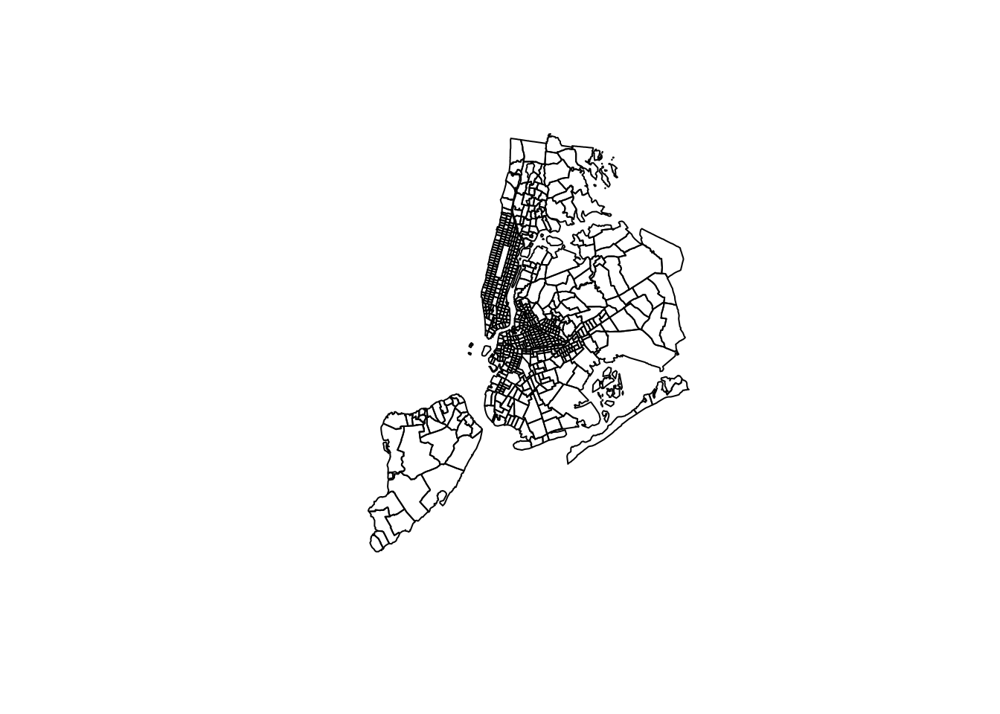

# Historical Census data analysis with NHGIS and IPUMS


Most of the examples covered in the book to this point use data from recent US Census Bureau datasets such as the Decennial Census since 2000 and the American Community Survey. These datasets are available through the US Census Bureau's APIs and in turn accessible with tidycensus and related tools. However, analysts and historians may be interested in accessing data from much earlier - perhaps all the way back to 1790, the first US Census! Fortunately, these historical datasets are available to analysts through the [National Historical Geographic Information System (NHGIS) project](https://www.nhgis.org/) and the [Minnesota Population Center's](https://pop.umn.edu/) [IPUMS project](https://ipums.org/). While both of these data repositories have typically attracted researchers using commercial software such as ArcGIS (for NHGIS) and Stata/SAS (for IPUMS), the Minnesota Population Center has developed an associated [ipumsr](http://tech.popdata.org/ipumsr/) R package to help analysts integrate these datasets into R-based workflows.

This chapter provides an overview of how to access and use historical US Census datasets in R with NHGIS, IPUMS, and the ipumsr package. Due to the size of the datasets involved, these datasets are not provided with the sample data available in the book's data repository. To reproduce, readers should follow the steps provided to sign up for an IPUMS account and download the data themselves.

## Getting started with NHGIS

To get started with NHGIS, visit...

## Example


```r
library(ipumsr)
library(tidyverse)

nyc_1910 <- read_nhgis_sf(
  data_file = "data/NHGIS/nhgis0099_csv.zip",
  shape_file = "data/NHGIS/nhgis0099_shape.zip"
) %>%
  filter(!is.na(TRACTA))
```

```
## Use of data from NHGIS is subject to conditions including that users should
## cite the data appropriately. Use command `ipums_conditions()` for more details.
## 
## 
## Reading data file...
## Reading geography...
## options:        ENCODING=latin1 
## Reading layer `US_tract_1910' from data source 
##   `/tmp/Rtmp7vZadR/file53f2257365b7/US_tract_1910.shp' using driver `ESRI Shapefile'
## Simple feature collection with 1989 features and 6 fields
## Geometry type: MULTIPOLYGON
## Dimension:     XY
## Bounding box:  xmin: 489737.4 ymin: 130629.6 xmax: 2029575 ymax: 816129.7
## Projected CRS: USA_Contiguous_Albers_Equal_Area_Conic
## options:        ENCODING=latin1 
## Reading layer `US_tractcounty_1910' from data source 
##   `/tmp/Rtmp7vZadR/file53f2257365b7/US_tractcounty_1910.shp' 
##   using driver `ESRI Shapefile'
## Simple feature collection with 472 features and 16 fields
## Geometry type: MULTIPOLYGON
## Dimension:     XY
## Bounding box:  xmin: 18912.79 ymin: -153678.5 xmax: 2137763 ymax: 1051772
## Projected CRS: USA_Contiguous_Albers_Equal_Area_Conic
```

```r
nyc_1910
```

```
## Simple feature collection with 704 features and 58 fields
## Geometry type: MULTIPOLYGON
## Dimension:     XY
## Bounding box:  xmin: 1810884 ymin: 544085.4 xmax: 1851324 ymax: 596805.5
## Projected CRS: USA_Contiguous_Albers_Equal_Area_Conic
## # A tibble: 704 x 59
##    NHGISST NHGISCTY GISJOIN       GISJOIN2     SHAPE_AREA SHAPE_LEN
##  * <chr>   <chr>    <chr>         <chr>             <dbl>     <dbl>
##  1 360     0610     G3600610B0002 3600610B0002    382739.     3279.
##  2 360     0610     G3600610B0001 3600610B0001   1141818.     6311.
##  3 360     0470     G36004700058  36004700058     153367.     1603.
##  4 360     0470     G36004700059  36004700059     209366.     2082.
##  5 360     0470     G36004700062  36004700062     155479.     1608.
##  6 360     0470     G36004700042  36004700042     215673.     1939.
##  7 360     0470     G36004700030  36004700030     178404.     1718.
##  8 360     0470     G36004700031  36004700031     163969.     1605.
##  9 360     0470     G36004700032  36004700032     326661.     2511.
## 10 360     0470     G36004700033  36004700033     252369.     2200.
## # … with 694 more rows, and 53 more variables: geometry <MULTIPOLYGON [m]>,
## #   layer <chr>, DECADE <chr>, ICPSRCTY <chr>, ICPSRCTYI <dbl>, ICPSRFIP <dbl>,
## #   ICPSRNAM <chr>, ICPSRST <chr>, ICPSRSTI <dbl>, ICPSRUNI <chr>,
## #   NHGISNAM <chr>, STATENAM <chr>, YEAR <dbl>, STATE <chr>, STATEA <dbl>,
## #   COUNTY <chr>, COUNTYA <chr>, PRETRACTA <chr>, TRACTA <chr>,
## #   POSTTRCTA <lgl>, AREANAME <chr>, A6G001 <dbl>, A6G002 <dbl>, A6G003 <dbl>,
## #   A6G004 <dbl>, A6G005 <dbl>, A6G006 <dbl>, A6G007 <dbl>, A6G008 <dbl>,
## #   A6G009 <dbl>, A6G010 <dbl>, A6G011 <dbl>, A6G012 <dbl>, A6G013 <dbl>,
## #   A6G014 <dbl>, A6G015 <dbl>, A6G016 <dbl>, A6G017 <dbl>, A6G018 <dbl>,
## #   A6G019 <dbl>, A6G020 <dbl>, A6G021 <dbl>, A6G022 <dbl>, A6G023 <dbl>,
## #   A6G024 <dbl>, A6G025 <dbl>, A60001 <dbl>, A60002 <dbl>, A60003 <dbl>,
## #   A60004 <dbl>, A60005 <dbl>, A60006 <dbl>, A60007 <dbl>
```


```r
plot(nyc_1910$geometry)
```




```r
library(crsuggest)
library(sf)

nyc_crs <- suggest_top_crs(nyc_1910, inherit_gcs = FALSE)

nyc_crs
```

```
## [1] 6539
```


```r
nyc_pctfb <- nyc_1910 %>%
  rowwise() %>%
  mutate(total = sum(c_across(A60001:A60007))) %>%
  ungroup() %>%
  transmute(
    tract_id = GISJOIN,
    pct_fb = A60005 / total
  ) %>%
  st_transform(nyc_crs)
```


And visualize: 


```r
ggplot(nyc_pctfb, aes(fill = pct_fb)) + 
  geom_sf(color = NA) + 
  scale_fill_viridis_c(option = "magma", labels = scales::percent) + 
  theme_void(base_family = "Verdana") + 
  labs(title = "Percent foreign-born by Census tract, 1910",
       subtitle = "New York City",
       caption =  "Data source: NHGIS",
       fill = "Percentage")
```


Alternatively, a dot-density map of a group of immigrants:


```r
italy_dots <- nyc_1910 %>%
  st_transform(nyc_crs) %>%
  st_sample(size = as.integer(.$A6G014 / 100)) %>%
  st_sf()

nyc_base <- nyc_1910 %>%
  st_transform(nyc_crs) %>%
  st_union()
```

And visualize the result:


```r
ggplot() + 
  geom_sf(data = nyc_base, size = 0.1) + 
  geom_sf(data = italy_dots, shape = ".", color = "darkgreen") + 
  theme_void(base_family = "Verdana") + 
  labs(title = "Italy-born population in New York City, 1910",
       subtitle = "1 dot = 100 people",
       caption = "Data source: NHGIS")
```


## Historical microdata with IPUMS

